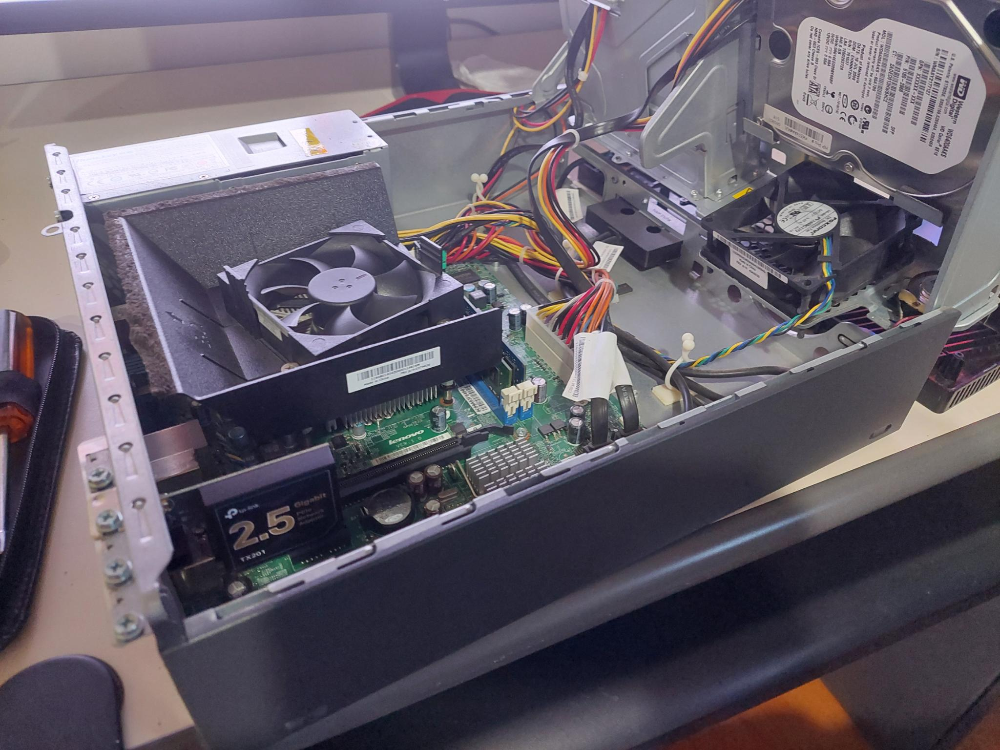

# Secure Home Network Deployment - Linux

## Project Overview

This project involves setting up and configuring a robust home network, moving from a standard consumer-grade router to a custom-built, server-centric system.

**Key implementations include:**

-   A dedicated RHEL derivative Linux server is being set up to act as the central router and firewall for the entire home network.
-   This server will handle all IP address assignments (DHCP) and implement network-wide ad-blocking and content filtering using AdGuard Home (DNS).
-   A Virtual Private Network (VPN) server (WireGuard) is being configured on the Linux server for secure remote access.
-   The network will be logically divided into separate security zones (e.g., a main trusted network and an isolated network for guests and smart home devices) to enhance security and prevent unauthorized access between different types of devices.
-   Network speed is being upgraded with 2.5 Gigabit Ethernet for faster internet and internal data transfers.
-   All network components, configurations, and security measures are being thoroughly documented.

---

## 💻 Technologies Used 🌐

This section outlines the key hardware and software components leveraged in the development and operation of the secure home network lab, detailing their specific roles.

| Component Type             | Specific Model / Software                                        | Role in Project                                                                                                                                                             |
| :------------------------- | :--------------------------------------------------------------- | :-------------------------------------------------------------------------------------------------------------------------------------------------------------------------- |
| **Hardware** |                                                                  |                                                                                                                                                                             |
| Main Server / Router       | Lenovo ThinkCentre M71e SFF PC (Intel Core i5-2400, 8 GB RAM)    | Serves as the central router and firewall; hosts all primary network services (DHCP, DNS, VPN).                                                                             |
| Network Interface Card (NIC) | TP-Link TX201 2.5 Gigabit PCIe Network Adapter                   | Provides high-speed 2.5 Gigabit Ethernet connectivity for the WAN/LAN connection on the server.                                                                             |
| Wireless Access Point      | ASUS RT-AC68U Wireless Router                                    | Reconfigured to operate in Access Point (AP) mode, providing Wi-Fi connectivity (2.4 GHz & 5 GHz) for all wireless clients.                                                 |
| Internet Modem             | Technicolor TC4350 DOCSIS 3.0 Cable Modem                      | Interfaces with the Internet Service Provider (ISP) to deliver the primary internet connection.                                                                             |
| **Software & OS** |                                                                  |                                                                                                                                                                             |
| Server Operating System    | AlmaLinux OS (RHEL derivative)                                   | Provides a stable, secure, and robust foundation for all network services and custom configurations on the ThinkCentre.                                                     |
| Firewall / Packet Filtering | `nftables` / `firewalld`                                         | Implemented on the AlmaLinux server to enforce granular firewall rules, segment network traffic, and provide Network Address Translation (NAT).                               |
| DHCP Server                | `dnsmasq` or `isc-dhcp-server`                                   | Configured on the Linux server to manage and assign IP addresses to all devices within the network.                                                                         |
| DNS / Ad-blocking          | AdGuard Home                                                     | Deployed as the network's primary DNS resolver, enabling network-wide ad-blocking, tracker filtering, and enhanced privacy.                                                 |
| Virtual Private Network (VPN)| WireGuard                                                        | Set up on the server to provide secure, encrypted remote access to the home network for administration and secure Browse.                                                   |
| Remote Management          | SSH (Secure Shell)                                               | Utilized for secure command-line remote administration and management of the AlmaLinux server.    |

---

## Project Implementation & Objective Achievement

### **1. Objective: Establish a Robust Linux-Based Router and Firewall**

*Goal: To establish a central, high-performance, and secure routing and firewall solution using a dedicated Linux server, providing granular control over network traffic.*

#### **Physical Installation: 2.5 Gigabit Network Adapter**

The TP-Link TX201 2.5 Gigabit PCIe Network Adapter was physically installed into an available PCIe slot on the Lenovo ThinkCentre M71e. This critical hardware upgrade enables multi-gigabit connectivity, essential for both the WAN (Internet) interface and future high-speed internal network segments.

#### **Preparation of OS Installation Media**

The OS installation media was prepared by burning the official ISO to a USB drive using balenaEtcher. This bootable USB drive will be used to install the operating system on the ThinkCentre.

#### **BIOS/UEFI Configuration and System Preparation**

This section details the critical BIOS/UEFI settings configured on the Lenovo ThinkCentre M71e prior to the OS installation, ensuring optimal performance, boot behavior, and server reliability.

**Key Configurations Documented:**

   -   Remote Wake-up: Configured "Wake from PCI Device" and "Wake on LAN" settings to Enabled to allow for remote power-on via the network
   -   Power Failure Recovery: Enabled the "Power On After AC Loss" option so the system power on automatically after a power outage in order to restore network connectivity.
   -   Keyboardless Operation: Enabled the "Keyboardless Operation" setting to allow the server to boot successfully without a keyboard attached. This is essential for a headless server setup.
   -   Virtualization Technology (Intel VT-x): Ensured Intel VT-x was enabled for future flexibility with virtualization technologies.

#### **Server Operating System Installation**

    
    
